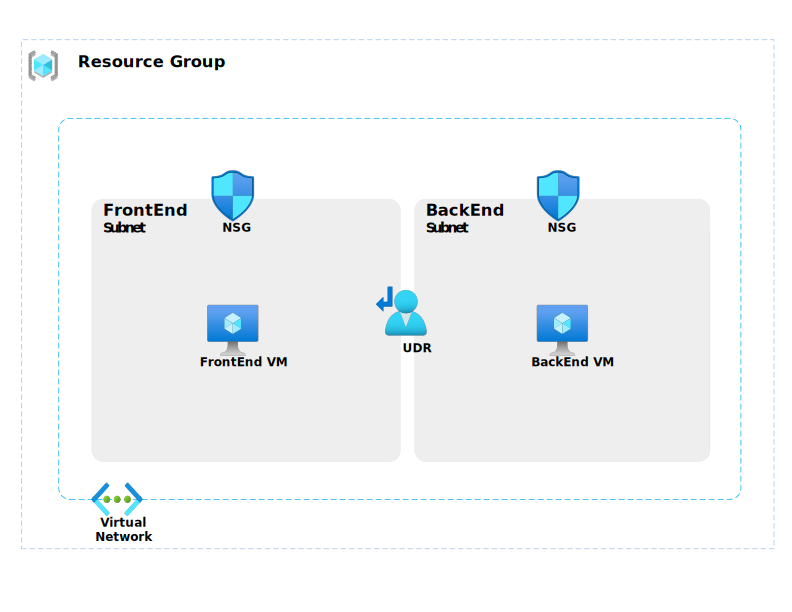

<!-- omit in toc -->
# Azure-NetworkTS

This repository contains a Azure deployment template for two Virtual machines in separate Subnmets but in a single VNET.
Deployiong this template allows you to use Azure Network troubleshooting tools like Network Watcher, NSG Flow Logs, and Diagnostics logs to troubleshoot network issues.
There are three pre-defined scenarios avaialble in the template to simulate network issues. Those scenarios are described below as if it was a description of a customer issue / support ticket.

The goal here is to not only understand the issue but also to understand the tools and resources available in Azure to troubleshoot the issue without signing in to the VM's.

> [!NOTE]
> This template and the pre-defined scenarios are highly customizable so please feel free to modify the template and scenarios to fit your learning needs or use this as a starting point to create your own network troubleshooting lab.

> [!WARNING]
> This template is for educational purposes only and should not be used in production environments.

<!-- omit in toc -->
## Table of Contents

1. [Deployment steps](#deployment-steps)
2. [Tools to use for troubleshooting](#tools-to-use-for-troubleshooting)
3. [Diagram of the deployment](#diagram-of-the-deployment)
4. [Scenario A: FrontEnd VM cannot connect via RDP to BackeEnd VM](#scenario-a-frontend-vm-cannot-connect-via-rdp-to-backeend-vm)
5. [Scenario B: VM's cannot connect to Internet](#scenario-b-vms-cannot-connect-to-internet)
6. [Scenario C: Backend VM cannot connect to FrontEnd VM](#scenario-c-backend-vm-cannot-connect-to-frontend-vm)
7. [Solution](#solution)

## Deployment steps

Deploy the template using one of the following methods:

<details open>
<summary><b>Azure Portal Deployment</b></summary>
<p>

[](https://portal.azure.com/#blade/Microsoft_Azure_CreateUIDef/CustomDeploymentBlade/uri/https%3A%2F%2Fraw.githubusercontent.com%2FPieterbasNagengast%2FAzure-NetworkTS%2Fmain%2FARM%2Fmain.json/uiFormDefinitionUri/https%3A%2F%2Fraw.githubusercontent.com%2FPieterbasNagengast%2FAzure-NetworkTS%2Fmain%2FuiDefinition.json)

</details>

<details>
<summary><b>Manual deployment</b></summary>

1. Open your prefered Powershell (e.eg. Azure Cloud Shell, PowerShell)
2. Clone the repository

    ``` powershell
    git clone https://github.com/PieterbasNagengast/Azure-NetworkTS.git
    ```

3. Change the directory to the cloned repository
4. Create new resource group using the following command

    ``` powershell
    New-AzResourceGroup -Name <resource-group-name> -Location <location>
    ```

5. Run the following command to deploy the template

    ``` powershell
    New-AzResourceGroupDeployment -ResourceGroupName <resource-group-name> -TemplateFile .\main.bicep
    ```

6. Once the deployment is complete, you can access the resources in the Azure Portal.
7. To simulate the network issues, you can use the pre-defined scenarios and then use the Azure Network troubleshooting tools to troubleshoot the issues.
8. If you have successfully troubleshooted the issue you can re-deploy the template (go to step 4) to reset the resources and select the next scenario to troubleshoot.
9. Once you are done with the troubleshooting, you can delete the resource group to clean up the resources.
10. To delete the resource group, run the following command in the Azure Cloud Shell

    ``` powershell
    Remove-AzResourceGroup -Name <resource-group-name> -Force
    ```

</details>

## Tools to use for troubleshooting

- [Azure Network Watcher](https://learn.microsoft.com/en-us/azure/network-watcher/network-watcher-overview)
- [IP Flow Verify](https://learn.microsoft.com/en-us/azure/network-watcher/ip-flow-verify-overview)
- [NSG Diagnostics](https://learn.microsoft.com/en-us/azure/network-watcher/network-watcher-network-configuration-diagnostics-overview)
- [Next Hop](https://learn.microsoft.com/en-us/azure/network-watcher/network-watcher-next-hop-overview)
- [Effective Routes](https://learn.microsoft.com/en-us/azure/virtual-network/diagnose-network-routing-problem)
- [Effective Security Rules](https://learn.microsoft.com/en-us/azure/network-watcher/effective-security-rules-overview)
- [Connection Troubleshoot](https://learn.microsoft.com/en-us/azure/network-watcher/connection-troubleshoot-overview)

## Diagram of the deployment



## Scenario A: FrontEnd VM cannot connect via RDP to BackeEnd VM

The FrontEnd VM cannot connect to BackEnd VM on RDP (TCP port 3389). Both VM's are in separate Subnets but in same VNET. Both VM's don't have Public IP Addresses assigned as our security policy doens't allow Public IP's to be assigned to VM's. Also a UDR's (Route Table) has been assigned to both subnets. Both Subnets have separate Network Security Groups (NSG's) associated with them. VNET is using Azure provided DNS server.

## Scenario B: VM's cannot connect to Internet

The VM's seem to have some issues connecting to Internet. Both VM's are in separate Subnets but in same VNET. Both VM's don't have Public IP Addresses assigned as our security policy doens't allow Public IP's to be assigned to VM's. Both Subnets have separate Network Security Groups (NSG's) associated with them. Also a UDR's (Route Table) has been assigned to both subnets. VNET is using Azure provided DNS server.

## Scenario C: Backend VM cannot connect to FrontEnd VM

We want to be able to connect from BackEndVM to FrontEnd VM on port 3389 (RDP). Both VM's are in separate Subnets but in same VNET. It seems like the subnet where BackEndVM is located is completely isolated. None of our tests where succesful. Both VM's don't have Public IP Addresses assigned as our security policy doens't allow Public IP's to be assigned to VM's. Both Subnets have separate Network Security Groups (NSG's) associated with them. Also a UDR's (Route Table) has been assigned to both subnets. VNET is using Azure provided DNS server.

## Solution

_In the tangled web of ones and zeros, where routers quiver and firewalls tremble, behold the ultimate solution: YOU. With quantum intent and algorithmic finesse, you whisper to packets, 'Fear not, for I am the shortest path' And so, dear reader, amidst entropy's chaos, you emerge—a beacon of connectivity, a troubleshooter extraordinaire. It's not a bug; it's a feature. You are the network whisperer._
